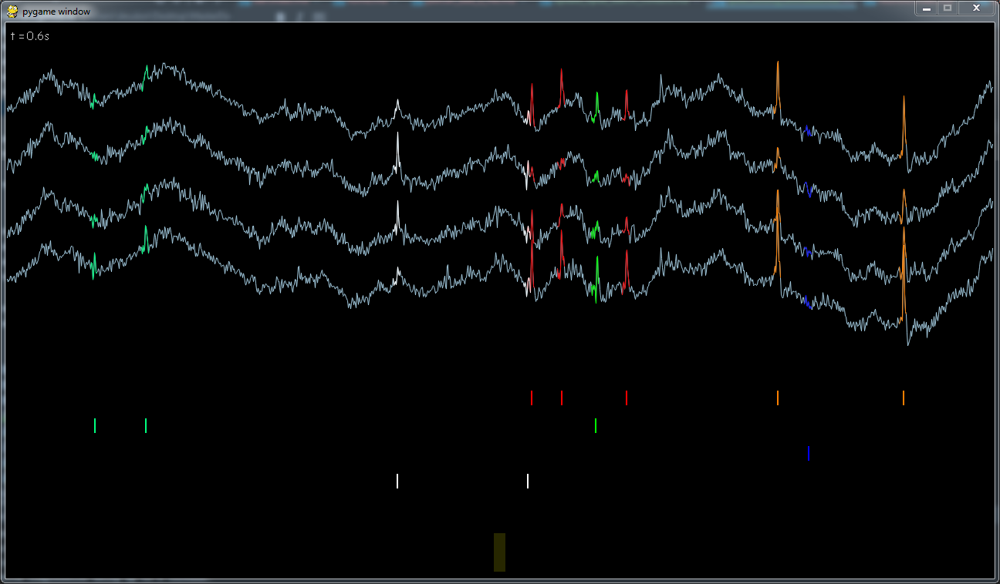

# Spike Sorting Animation

These scripts illustrate the spike-sorting principles using Python and pygame.

 * *spikesorting_game_1.py* shows the raw signal on 1 tetrode
 * *spikesorting_game_1_2.py* shows both the raw and filtered signal (~300-3000Hz)
 * *spikesorting_game_2.py* shows the raw signal on top and the action potential after spike detection
 * *spikesorting_game_3.py* shows the results of the spike sorting, i.e. each action potential is colored differently depending on the neuron having emitted the spike.

See more info here : [https://tinmard.github.io/spike-sorting-animation.html](https://tinmard.github.io/spike-sorting-animation.html)

